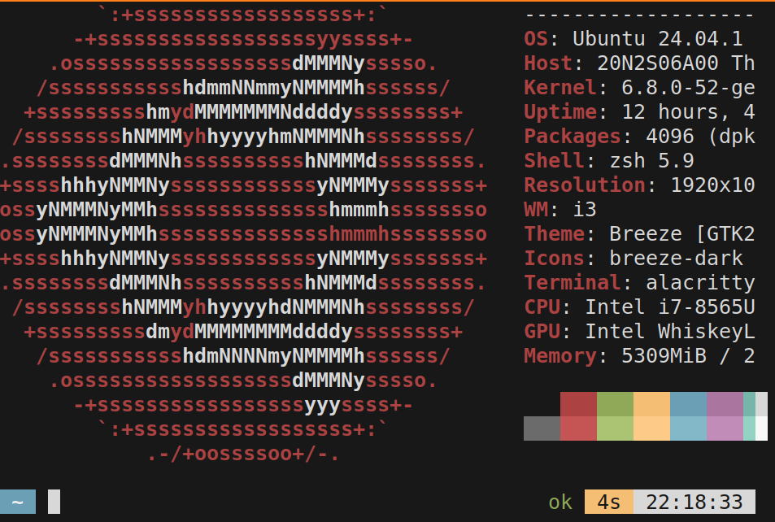

# ABD - ASCII Block Diagrams tool

## IMPORTANT NOTES

The first alpha release will come before the entire codebase, due to needed refactoring operations.

## Introduction

Simple SW for creating ASCII-art-like Block Diagrams.

### Specs
- Projects saved as `.json` files.
- Usable in every text-based files, by copying it using the `copy` command in the SW shell.
- Block Diagrams can be exported as `.png` images.  
- Development & test setup:
    - 