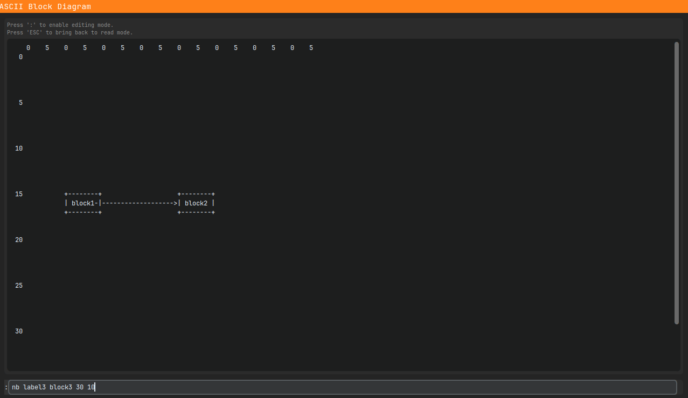

# ABD - ASCII Block Diagrams tool

## IMPORTANT NOTES

- It's the first time that i use github; be kind please c:
- The first alpha release will come before the entire codebase, due to needed refactoring operations.
- Of course, bugs will be present :c 

---

## Introduction

Simple SW for creating ASCII-art-like Block Diagrams. Here's a screenshot of a simple block diagram:

### Specs
- Projects are saved as `.json` files.
- Usable in every text-based files, by copying it using the `copy` command in the SW shell.
- Block Diagrams can be exported as `.png` images.  

## Test & development setup

Actually, i've only test the app on my personal computer, which runs the following setup:
    - 

## Build process

Actually, 'cause the project is python-based, the build of this sw would be compiled with `pyinstaller`.

---

## Development state & (possible) implementation

Actually, this code it's just a **prototype of an idea** i had.

Just a few points to explain what's in my head about:
- It is born from a personal need in order to ehance my development workflow.
- This project will be developed during my free time; i'm a little bit busy right now, but i'll try my best.
- **Maybe**, there would be another "piece" of this SW, in order to convert directly in GUI the ASCII diagrams into better-looking diagrams (exportable as .png and, maybe, .pdf and .svg)

*Of course, every suggestion/improvement would be appreciated!*